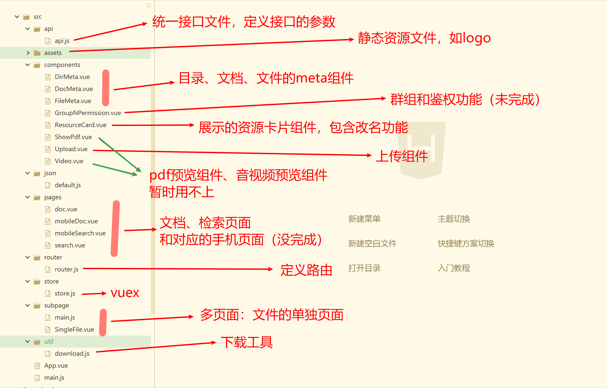

# upload

## 主要用到的东西
 - vue用于前端框架
 - [element ui](https://element.eleme.cn/#/zh-CN/component/installation)和[ant-design-vue](https://vue.ant.design/docs/vue/introduce-cn/)用于前端样式
 - [vue cli3](https://cli.vuejs.org/zh/)
 - [vue router](https://router.vuejs.org/zh/installation.html)
 - [vuex](https://vuex.vuejs.org/)


## 文件结构

旧版本代码结构如下（李培文），现版本代码 有新的改变




## 待解决

- 未完成组件：群组鉴权、历史版本、移动端适配

- 看老师意思：个人信息和部门文档

- 想完成的功能：

  - [ ] 实现预览视频
  
- 不够优雅的地方：

  

  - [ ] 应该能多个对象同时删除

  - [ ] 文件移动

  - [ ] 浏览器刷新就会回到最开始的界面

  - [ ] 下载进度条

  - [ ] 预览窗口改善

    
  
    

- 

  | Num  | Bug                                                          | Debug                                                        |
  | ---- | :----------------------------------------------------------- | ------------------------------------------------------------ |
  | 1    | 文档、文件的属性中时间显示错误                               | <u>后端存储的时间问题</u>                                    |
  | 2    | 浏览器刷新会出现一条无字提示                                 |                                                              |
  | 3    | 上传的进度问题                                               | <u>目前98%之后就在等待后端回复了。</u>                       |
  | 4    | 网站底部，不在底部                                           | <u>目前相对浏览器窗口在底部了，但内容太长时会覆盖。</u>      |
  | 5    | 有些文件一直要等待缩略图生成，但是一直不生成。svg的缩略图无法打开，地址可以下载。 | <u>分配图片的函数handleResource不等了，直接给。无法打开就不用它的缩略图了，直接给。</u> |
  | 6    | 删除操作后 响应时间太长 用户点击其他操作 会打开算法.jpg      | <u>增加删除loading,强制等待</u>                              |
  
  


## Project setup

```
npm install
```

### Compiles and hot-reloads for development
```
npm run serve
```

### Compiles and minifies for production
```
npm run build
```

### Run your tests
```
npm run test
```

### Lints and fixes files
```
npm run lint
```

### Customize configuration


